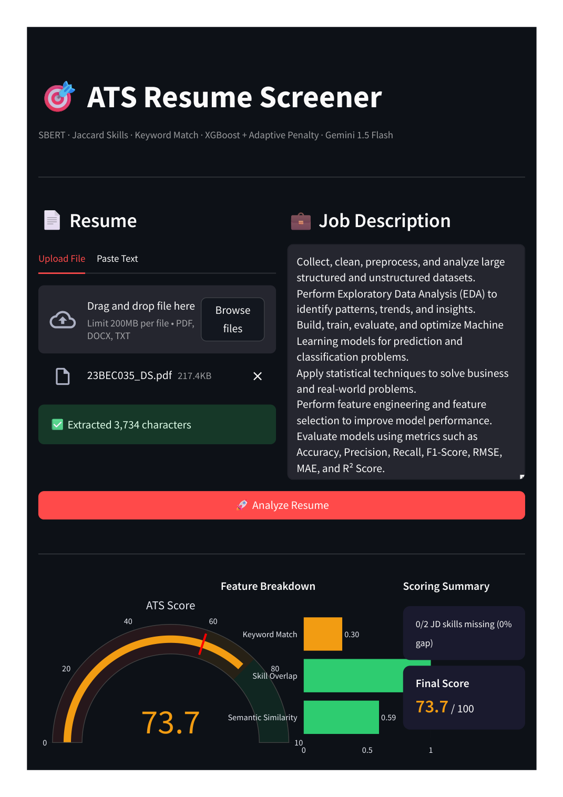
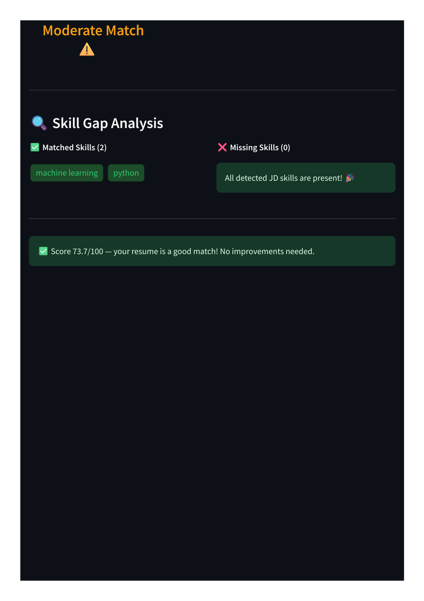

# 🎯 ATS Resume Screener & Optimizer

An AI-powered tool that compares a **resume with a Job Description (JD)** and gives an ATS-style score, shows skill/keyword matching, and provides suggestions to improve the resume.

### 💡 Simple idea

Think of the system as a **first-round resume filter**.

Instead of only asking *"Does this resume look similar to the job description?"*, it checks:

- 🧠 **Semantic similarity** — Does the resume talk about similar things?
- 🛠️ **Skill overlap** — Does it contain the required skills?
- 🔑 **Keyword matching** — Are important JD terms present?
- 📊 **XGBoost** — Combines these signals into an initial score.
- ⚡ **Adaptive skill penalty** — Reduces the score when required skills are missing.
- ✨ **Gemini** — Generates actionable resume improvement suggestions.

## 🔄 Workflow

```text
Resume + Job Description
          ↓
     Text Extraction
          ↓
     Feature Extraction
   ┌──────┼─────────────┐
   ↓      ↓             ↓
 SBERT  Skill Match  Keywords
   └──────┼─────────────┘
          ↓
       XGBoost
          ↓
  Adaptive Skill Penalty
          ↓
     Final ATS Score
          ↓
   Gemini Suggestions
```

## 🧠 Model

The XGBoost regression model was trained on **1,600 synthetic resume–JD pairs** using a skill-aware labeling strategy.

The main features are:

| Feature | Purpose |
|---|---|
| SBERT Similarity | Measures semantic similarity between resume and JD |
| Jaccard Skill Overlap | Measures overlap between required and detected skills |
| Keyword Match Ratio | Measures direct keyword coverage |

The final score is reported on a **0–100 scale**.

## 📊 Example Result

The following result is from the included final project output.



**Result from the example above:**

- **Final ATS Score:** 73.7 / 100
- **Semantic Similarity:** 0.59
- **Skill Overlap:** 1.00
- **Keyword Match:** 0.30
- **Missing JD Skills:** 0 / 2
- **Matched Skills:** Machine Learning, Python

The system classified this example as a **Moderate Match**. Importantly, all detected JD skills were present, while the lower keyword-match value shows that semantic/skill matching and exact keyword coverage can provide different signals.

### 🔍 Skill Gap Analysis



In this example, the system detected **2 matching skills and no missing skills**, and therefore did not recommend improvements for the resume.

## 🛠️ Tech Stack

**Python · NLP · SBERT · XGBoost · Gemini API · NumPy · Scikit-learn**

## 📁 Repository Structure

```text
├── Outputs/                   # Final result screenshots/outputs
├── models/                    # Trained ML models
├── app.py                     # Application
├── ats_pipeline_notebook.ipynb # Model development pipeline
├── ATS Resume Screener.pdf   # Final project results
├── README.md
└── LICENSE
```

## ▶️ Run the Project

```bash
pip install -r requirements.txt
streamlit run app.py
```

Then upload/paste a resume, add a Job Description, and click **Analyze Resume**.

## 🎯 Key Takeaway

This project combines **NLP + Machine Learning + Generative AI** to make resume screening more than just a single similarity score.

> **In short:** it tells you **how well your resume matches a job, what skills are covered or missing, and how you can improve it.**
